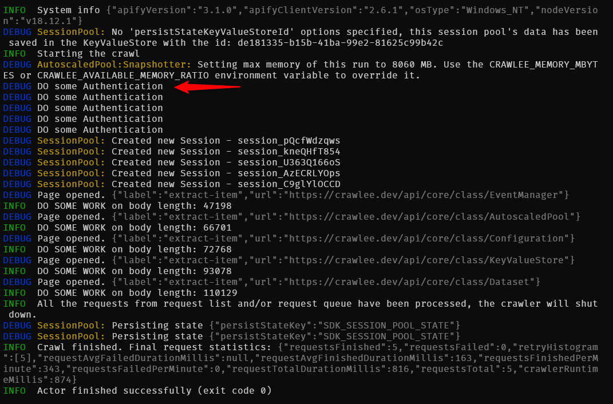

# Apify crawler maxPoolSize: 1 - bug

When you configure a crawler with a maximum pool size of `1` it still create multiple sessions.
This bug occurs when the crawler use a named `RequestQueue` containing pending requests.

# How to reproduce

1. copy all `*.json` files from `storage/request_queues/sample/` into `storage/request_queues/crawl-q`
2. run `npm start`

You will see multiple debug logs with `DO some Authentication` string.



On some webistes there is a limit on authenticated sessions. Thus the following error is thrown.


# Expected behavior

Since maxPoolSize is `1` the crawler should open only one authenticated session.
However, there is a race condition and it tries to authenticated multiple times.

# Bug source

[session_pool.ts:394](https://github.com/apify/crawlee/blob/22467ca81ad9464d528495333f62a60f2ea0487c/packages/core/src/session_pool/session_pool.ts#LL390C5-L395C6)

In this particular scenario, when function `_hasSpaceForSession` is called `this.session.length` remains at `0` until `createSessionFunction` resolves.

```ts
protected _hasSpaceForSession(): boolean {
  return this.sessions.length < this.maxPoolSize;
}
```

During `createSessionFunction` if we call a network endpoint, node runtime will continue processing the `RequestQueue` and thus calling [getSession() - session_pool.ts:270](https://github.com/apify/crawlee/blob/22467ca81ad9464d528495333f62a60f2ea0487c/packages/core/src/session_pool/session_pool.ts#L270) multiple times.
